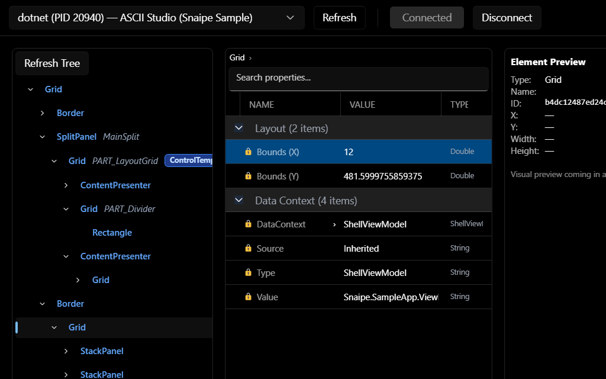
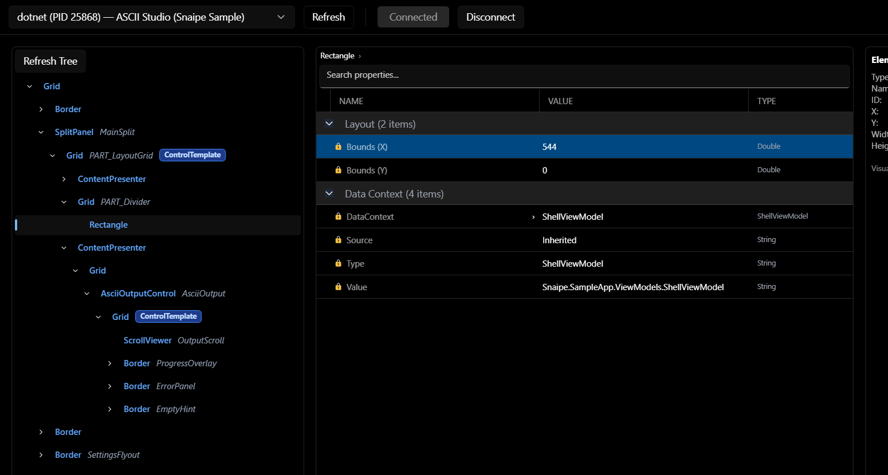
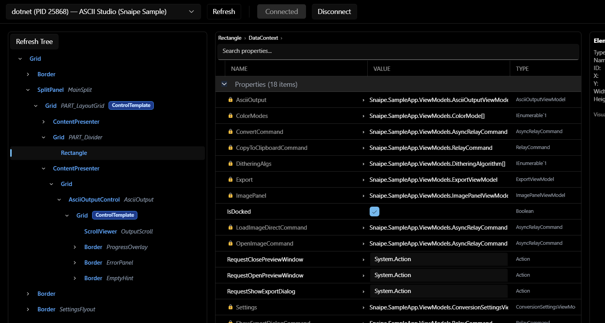
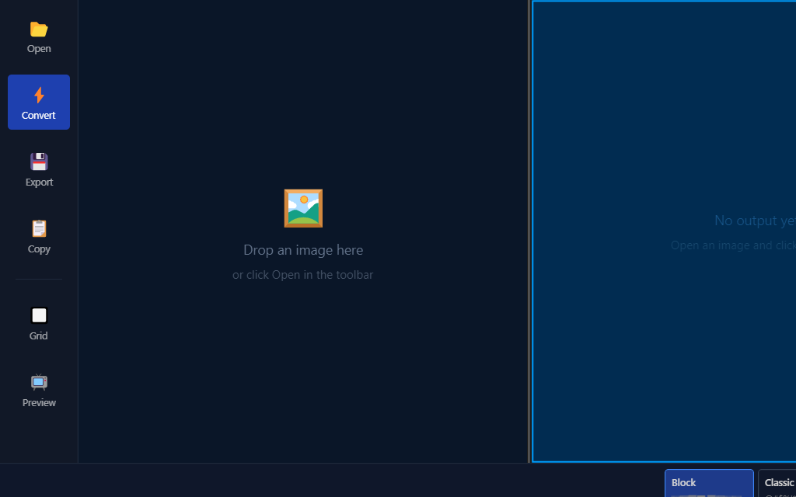
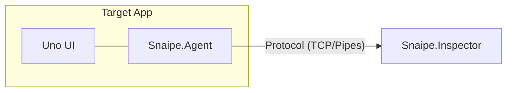

# Snaipe

The visual tree inspector for [Uno Platform](https://platform.uno/) Desktop.



Snaipe is a cross-platform debugging tool for Uno developers. Inspect trees, edit properties, and debug bindings in real-time on Windows and Linux. Think [Snoop WPF](https://github.com/snoopwpf/snoopwpf) or [WPF Inspector](https://wpfinspector.codeplex.com/), but for Uno Desktop targets using the Skia renderer.

## Features

### Visual Tree Explorer
Browse the live UI element hierarchy of any running Uno Skia Desktop app. Easily navigate complex trees and search for specific elements.



### DataContext Drilldown
Inspect the live ViewModel and data bindings for any element in the tree. Reveal the source of your data instantly.



> **Pro Tip:** Debug binding issues in seconds by seeing the live state of your ViewModel directly in the inspector.

### Live Property Editor
Inspect and edit dependency properties, attached properties, and bindings in real-time. See your changes reflected instantly in the running app.

### Pick Mode
Point and click on any element in your application to automatically locate and select it within the Snaipe inspector.



## Quick Start

### 1. Install the Agent
Add the `Snaipe.Agent` NuGet package to your Uno Platform Desktop project:

```bash
dotnet add package Snaipe.Agent
```

### 2. Attach the Agent
In your `App.xaml.cs` (or wherever you initialize your main window), attach the Snaipe agent:

```csharp
protected override void OnLaunched(LaunchActivatedEventArgs args)
{
    var window = new MainWindow();
    window.Activate();

    // Attach Snaipe Agent to the window
    Snaipe.Agent.SnaipeAgent.Attach(window);
}
```

### 3. Run the Inspector
Run the `Snaipe.Inspector` application to start debugging.

## Architecture



- **Snaipe.Agent:** A small library that walks the Uno visual tree and listens for commands.
- **Snaipe.Inspector:** A standalone Uno app that connects to the agent and renders the debugging UI.
- **Snaipe.Protocol:** Shared models and serialization contract.

## Tech Stack
- **.NET 9**
- **Uno Platform 6.x** (Skia Desktop)
- **System.IO.Pipelines** for high-performance IPC

## Status
Active development / functional prototype.

## License
MIT
